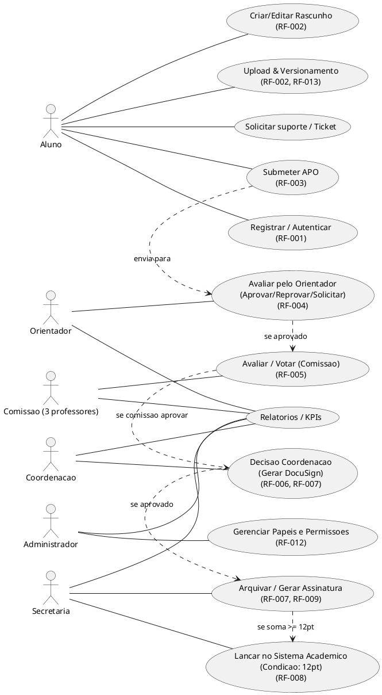
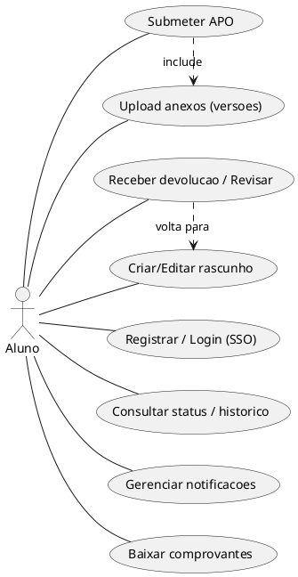
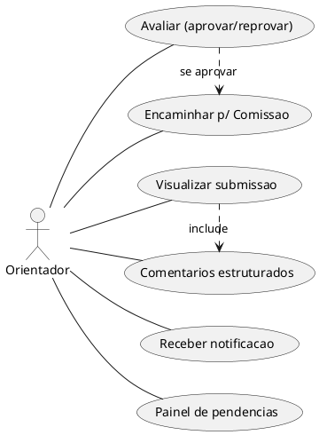
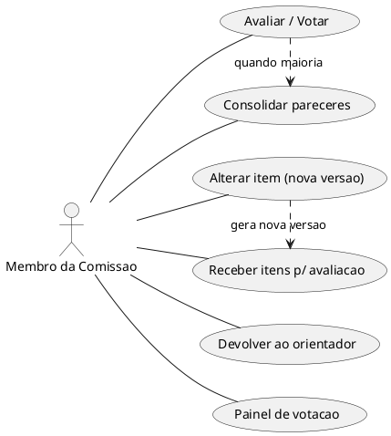
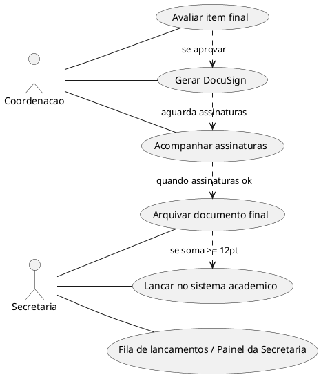
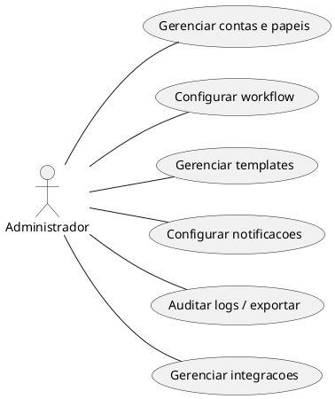

# APOFlow - Casos de Uso

Arquivo em Markdown com diagramas PlantUML. Contem casos de uso por papel e diagramas UML para cada conjunto de atores.

---

## Indice

1. Visao geral
2. Legenda e convencoes
3. Casos de uso por papel
4. Casos de uso por processo
5. Diagramas PlantUML
6. Notas e correlacao com requisitos

---

## 1. Visao geral

Este documento descreve os casos de uso funcionais principais do sistema APOFlow. Cada caso de uso tem um titulo, resumo curto e referencias aos requisitos quando aplicavel. O objetivo e cobrir o dia a dia dos atores do sistema: alunos, orientadores, membros da comissao, coordenacao, secretaria e administradores.

---

## 2. Legenda e convencoes

- Ator: entidade que interage com o sistema.
- UC: Use Case, com ID unico no formato `UC-###`.
- RF: requisito funcional associado.
- Principal: cenario feliz ou normal.
- Alternativa ou Excecao: caminhos de erro, devolucao ou reprocessamento.

---

## 3. Casos de uso por papel

### 3.1 Aluno

- UC-001: Registrar ou autenticar no sistema por SSO, LDAP ou email e senha. RF-001.
- UC-002: Criar rascunho de APO com titulo, tipo, descricao, pontos, orientador e anexos. RF-002.
- UC-003: Fazer upload de anexos com versionamento. RF-002 e RF-013.
- UC-004: Validar checklist antes do envio para garantir campos obrigatorios e formatos validos.
- UC-005: Submeter APO para avaliacao do orientador. RF-003.
- UC-006: Receber devolucao ou solicitacao de alteracao, revisar e reenviar. RF-004.
- UC-007: Consultar status, historico, trilha de auditoria e versoes. RF-009.
- UC-008: Acompanhar notificacoes no sistema e por email. RF-010.
- UC-009: Gerenciar perfil e preferencias de notificacao. RF-010.
- UC-010: Fazer download de comprovantes e documentos assinados. RF-007 e RF-009.
- UC-011: Solicitar suporte ou abrir ticket junto a secretaria.

### 3.2 Orientador

- UC-020: Receber notificacao de nova submissao. RF-003 e RF-010.
- UC-021: Visualizar submissao e anexos inline. RF-002.
- UC-022: Avaliar a submissao, podendo aprovar, reprovar ou solicitar alteracao. RF-004.
- UC-023: Encaminhar para a comissao quando aprovada. RF-004 e RF-005.
- UC-024: Inserir comentarios estruturados e sugerir ajustes.
- UC-025: Consultar painel de pendencias e filtros por orientado. RF-011.
- UC-026: Acompanhar historico e versoes. RF-009.

### 3.3 Comissao APO

- UC-030: Receber itens para avaliacao. RF-005.
- UC-031: Avaliar ou votar, aprovando, reprovando, alterando ou devolvendo. RF-005.
- UC-032: Propor alteracao e gerar nova versao.
- UC-033: Consolidar pareceres e encaminhar para coordenacao.
- UC-034: Solicitar reavaliacao ou devolver ao orientador.
- UC-035: Consultar painel de votacao e historico de decisoes. RF-009.

### 3.4 Coordenacao

- UC-040: Receber itens aprovados pela comissao. RF-006.
- UC-041: Avaliar e decidir, incluindo voto de minerva em empate. RF-006.
- UC-042: Acionar geracao de assinatura eletronica. RF-007.
- UC-043: Visualizar pendencias de assinatura. RF-007.
- UC-044: Forcar reabertura ou devolver para etapas anteriores.
- UC-045: Consultar KPIs e relatorios gerenciais.

### 3.5 Secretaria

- UC-050: Receber notificacao de aprovacao final. RF-006.
- UC-051: Gerar assinatura eletronica ou validar comprovantes. RF-007.
- UC-052: Arquivar documento final e versao assinada. RF-009.
- UC-053: Lancar no sistema academico quando a soma atingir 12 pontos. RF-008.
- UC-054: Verificar logs de integracao e reprocessar falhas. RF-008.
- UC-055: Gerenciar fila de trabalho da secretaria.
- UC-056: Exportar relatorios e pacotes para arquivo institucional.

### 3.6 Administrador do Sistema

- UC-060: Gerenciar contas, papeis e permissoes. RF-012.
- UC-061: Configurar workflow e regras de negocio.
- UC-062: Gerenciar templates e checklists.
- UC-063: Configurar notificacoes e SMTP. RF-010.
- UC-064: Auditar logs e exportar registros. RF-009.
- UC-065: Monitorar seguranca, virus scan e limites de upload. RF-013.
- UC-066: Gerenciar integracoes como DocuSign e sistema academico.

---

## 4. Casos de uso por processo

### 4.1 Fluxo de Submissao e Aprovacao

- UC-P01: Fluxo completo de submissao ate arquivamento, combinando UC-002, UC-003, UC-005, UC-021, UC-022, UC-023, UC-031, UC-033, UC-041, UC-042, UC-051, UC-052 e UC-053.

Principais caminhos alternativos:

- devolucao pelo orientador para correcao pelo aluno
- devolucao da comissao para o orientador
- solicitacao de correcao pela coordenacao
- empate na comissao resolvido por voto de minerva da coordenacao

### 4.2 Fluxo de Lancamento por Pontuacao

- UC-P02: O sistema soma pontos por aluno e cria tarefa para a secretaria quando o total atingir 12 pontos.

### 4.3 Fluxo de Assinatura Eletronica

- UC-P03: A coordenacao gera o envelope, assinantes recebem solicitacao, assinaturas sao confirmadas e comprovantes sao armazenados.

### 4.4 Gestao de Pendencias e Alertas

- UC-P04: Rotinas automatizadas enviam lembretes de prazos, revisoes pendentes e assinaturas nao concluidas. RF-010.

### 4.5 Auditoria e Exportacao

- UC-P05: Secretaria ou administrador exporta pacote com PDFs, metadados e log de arquivamento. RF-009.

---

## 5. Diagramas PlantUML

### 5.1 Diagrama geral

### 5.2 Diagrama do aluno

### 5.3 Diagrama do orientador

### 5.4 Diagrama da comissao

### 5.5 Diagrama de coordenacao e secretaria

### 5.6 Diagrama do administrador

---

## 6. Notas e correlacao com RFs

- Cada UC faz referencia aos requisitos funcionais RF-001 a RF-013 e pode ser usado para rastreabilidade.
- Para testes, e recomendado derivar casos de teste a partir de cada UC.
- Para o MVP inicial, recomenda-se priorizar UC-001, UC-002, UC-003, UC-005, UC-020, UC-022, UC-030, UC-031, UC-041, UC-042, UC-051 e UC-053.